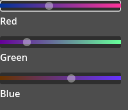

# rgb-sliders

A small Godot project containing reusable RGB slider controls and themes.

## Summary

This repository provides a compact set of colour/RGB slider controls and theme resources for Godot. It includes example scenes and scripts you can drop into your Godot project to allow users to pick colors using three sliders (R, G, B).

## Files of interest

- `project.godot` — Godot project file.
- `color_sliders.tscn` — Example scene demonstrating the sliders.
- `color_sliders.gd` — Controller script for the example scene.
- `slider_deluxe.gd` — Reusable slider control script.
- `color_slider_theme.tres` — Theme resource for the sliders.
- `slider_panel_normal.tres`, `slider_panel_focused.tres` — Slider panel styles.
- `LICENSE` — Project license.

## Requirements

- Godot Engine (open the project with your preferred stable version; project was created with 4.5).

## Usage

1. Open the project folder in Godot (open `project.godot`).
2. Open `color_sliders.tscn` and press Play to run the example scene.
3. To reuse the sliders in your project, instance `color_sliders.tscn` in your own Control nodes.

Note:  The customized sliders used in the project (`slider_deluxe.gd`) can be replaced with default Godot sliders.  The customized ones are designed to improve slider behavior when using gamepads. 

## Customization

- Edit `color_slider_theme.tres` to change colors, fonts, and spacing.
- Edit `slider_panel` themes.

## Contributing

Feel free to open issues or submit pull requests with improvements or fixes.

## License

See the `LICENSE` file in this repository for details.
